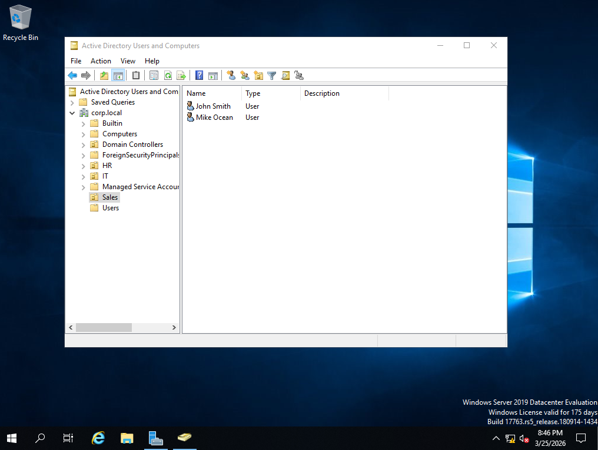
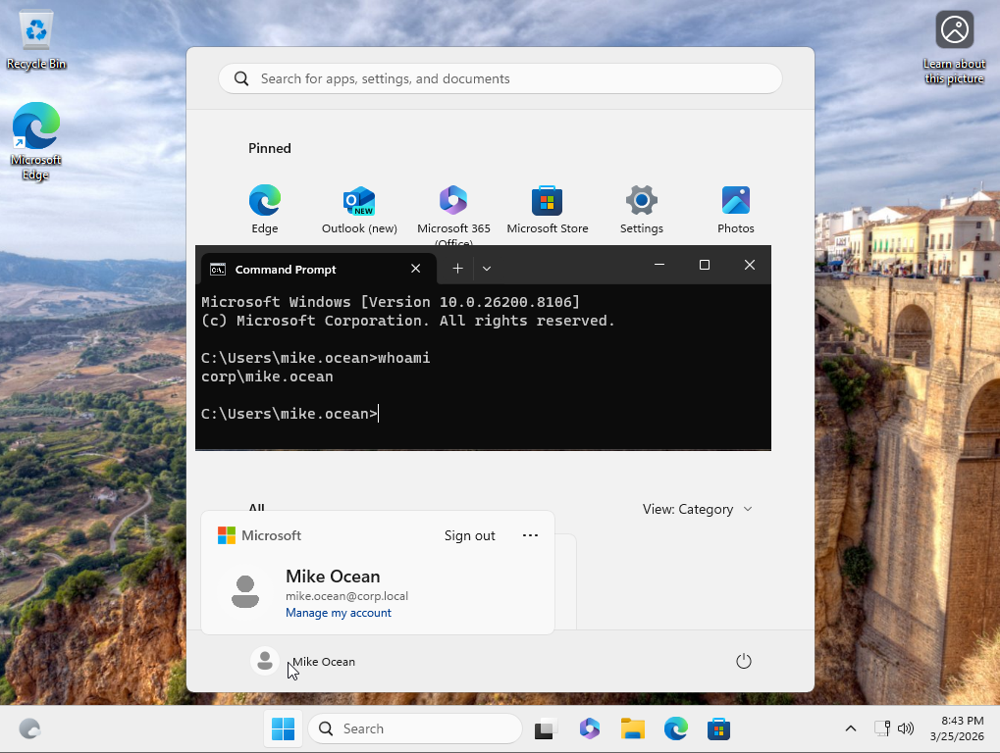
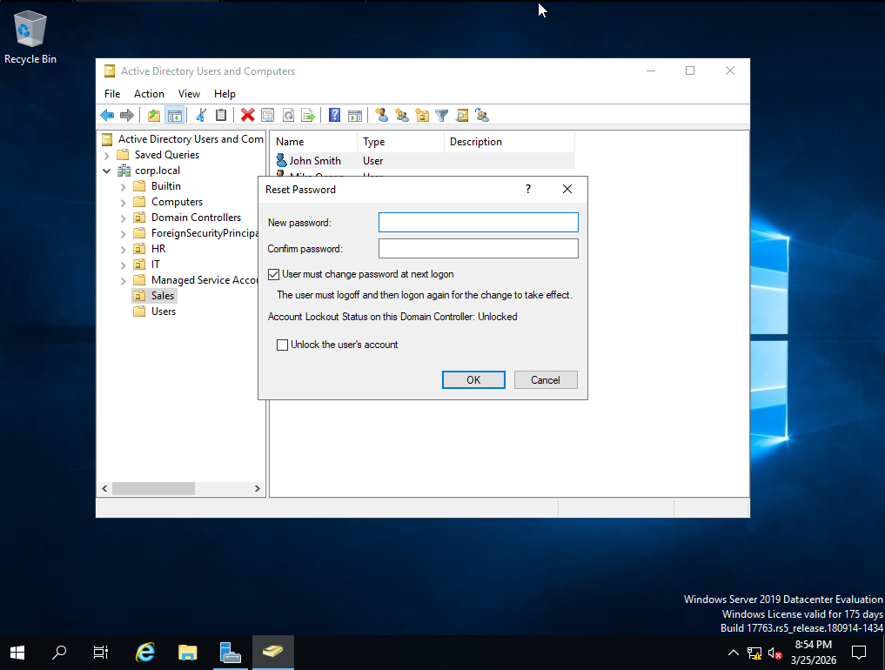
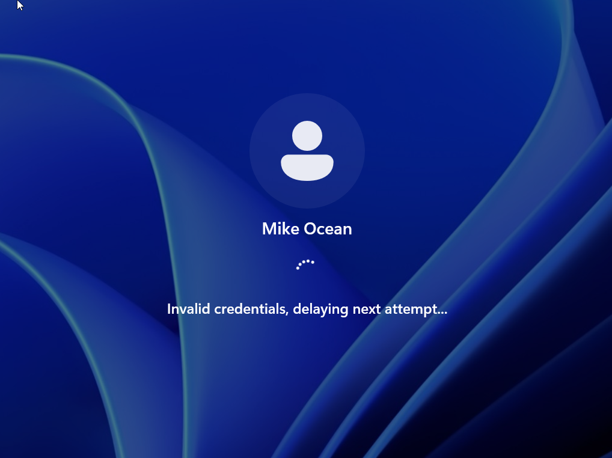
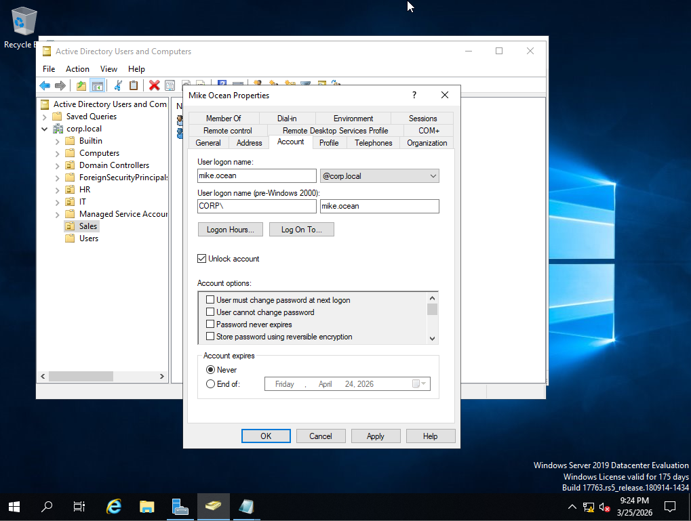
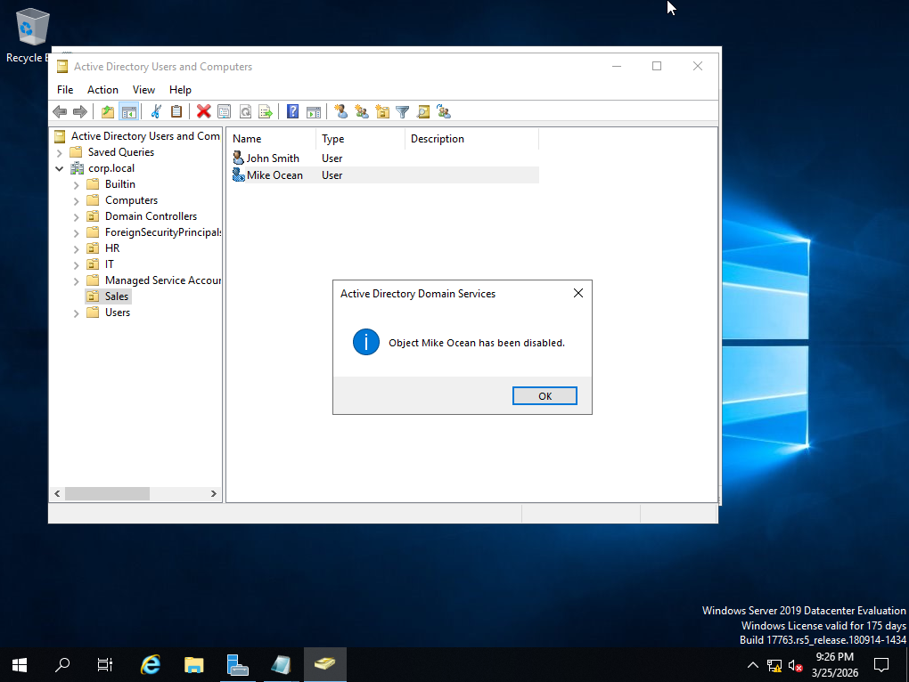
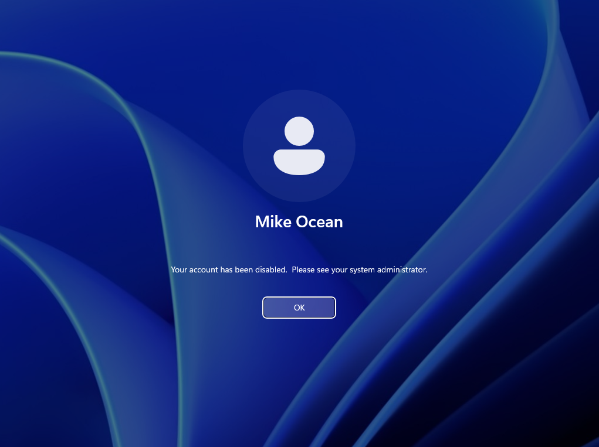

# Active Directory Home Lab

## Overview
This lab was built to simulate real-world IT support scenarios in an Active Directory environment. The lab simulates a basic enterprise network, including a Domain Controller and a domain-joined client machine.

The focus is on developing practical skills required for Service Desk roles, including user management, authentication troubleshooting, and domain connectivity issues.

---

## Lab Environment

- **Domain Controller:** Windows Server 2019 (DC01)
- **Client Machine:** Windows 11 (CLIENT01)
- **Domain:** corp.local
- **Virtualisation:** VMware

---

## Key Skills Demonstrated

- Active Directory Domain Services (AD DS)
- User account management and administration
- Password resets and account recovery
- Troubleshooting authentication and login issues
- Domain join and DNS configuration
- Virtual machine setup and management

---

## Setup

### Domain Controller Setup
- Installed Windows Server 2019  
- Configured static IP and DNS  
- Installed AD DS role  
[ Domain Controller Setup Guide](setup/domain-controller-setup.md)

### Active Directory Configuration
- Promoted server to Domain Controller  
- Created new forest: `corp.local`  
 [View Active Directory Configuration setup](setup/active-directory-setup.md)

### Client Domain Join
- Configured DNS to point to Domain Controller  
- Joined Windows 11 machine to domain  
- Verified domain authentication  
 [View Client Domain setup](setup/client-domain-join.md)

---

## Scenarios

### 1. User Creation and Login
Created a new user in Active Directory and successfully authenticated on a domain-joined client machine.     
### User Creation

### User Login

### 2. Password Reset
Reset a user password through Active Directory and verified successful login with updated credentials.
### Reset Password

### User Logon    

### 3. Account Lockout and Recovery
Simulated failed login attempts, identified account lockout, and restored access by unlocking the account.
### Failed Login Attempts

### Unlock Account    

### 4. User Offboarding (Account Disable)
Disabled a user account and confirmed access was blocked on login attempt.

### User Disabled

### Account Disable   

---

## Screenshots

Screenshots for each scenario and setup step are included in the `/screenshots` directory.

---

## Troubleshooting Approach

- Identified issues through systematic checks (network, DNS, authentication)
- Used tools such as ping, nslookup, and nltest to diagnose connectivity
- Applied step-by-step resolution and verified successful outcomes

---

## What I Learned

- How Active Directory manages authentication and user access
- Importance of DNS in domain environments
- Troubleshooting login and account-related issues
- Simulating real-world IT support scenarios in a lab environment

