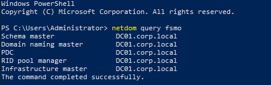
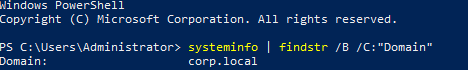

# Active Directory Setup

## Overview

Promoted the server to a Domain Controller and created a new domain.

## Steps

- Promoted server to Domain Controller

    

- Created new forest:

    - Domain: corp.local

        

- Configured DNS automatically during promotion

## Outcome

Active Directory environment successfully created with domain corp.local.

[← Back to README](../README.md)