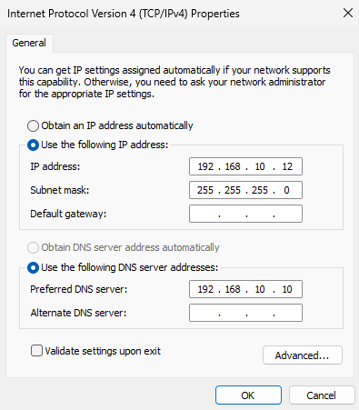
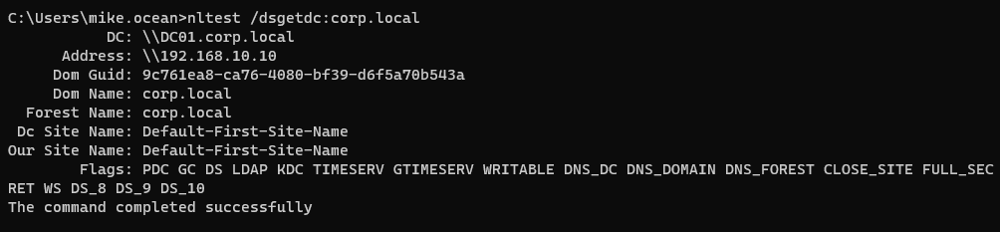

# Client Domain Join

## Overview

Connected a Windows 11 client machine to the Active Directory domain.

## Steps

- Configured DNS on client:

    - DNS: 192.168.10.10  
    

- Verified connectivity to Domain Controller

    #### Domain Controller Discovery
    

- Joined domain:

    - Domain: corp.local

- Restarted client machine

## Outcome

Client successfully joined to domain and able to authenticate users.

[← Back to README](../README.md)