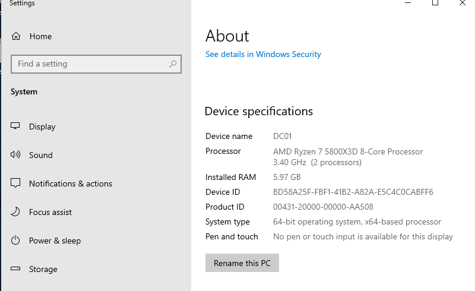
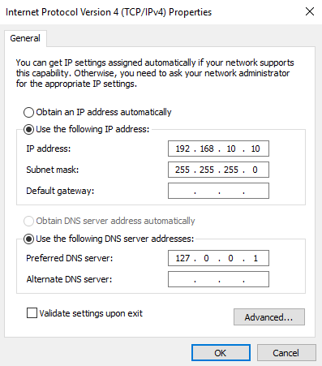

# Domain Controller Setup

## Overview

Set up a Windows Server 2019 virtual machine to act as a Domain Controller.

## Steps

- Installed Windows Server 2019 (Desktop Experience)

- Renamed server to DC01  

- Configured static IP:
     - IP: 192.168.10.10

    - Subnet: 255.255.255.0

    - DNS: 127.0.0.1

        

Configured_static_IP

- Installed Active Directory Domain Services (AD DS)

## Outcome

Server prepared for promotion to Domain Controller.

[← Back to README](../README.md)